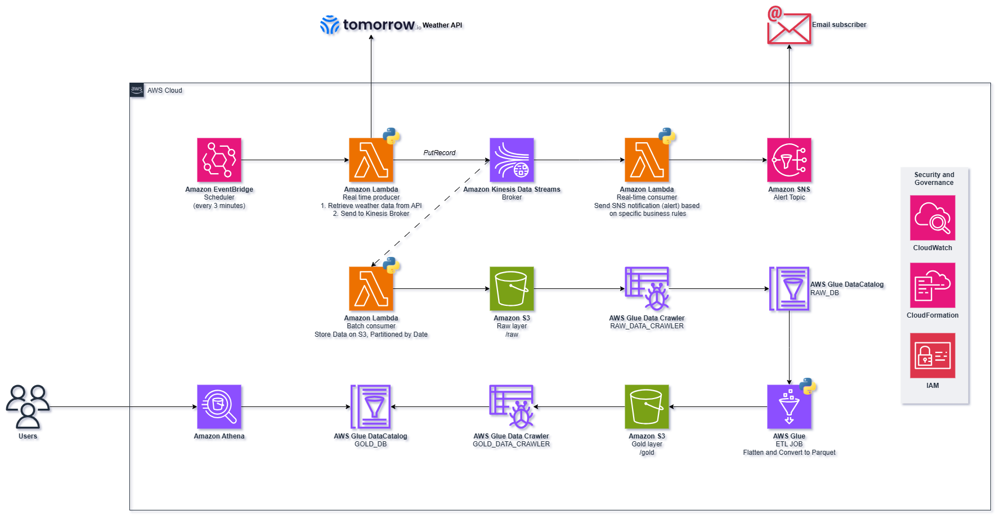

# Weather Data Pipeline

A comprehensive data pipeline that processes weather data from Tomorrow.io API using both real-time and batch processing approaches on AWS.

## Project Overview

This project implements two parallel data processing pipelines:
1. Real-time pipeline for immediate weather alerts
2. Batch pipeline for historical analysis and querying

## Architecture




### Real-time Processing Path
1. **EventBridge Scheduler** triggers the process every 3 minutes
2. **Lambda Producer** performs two functions:
   - Retrieves weather data from Tomorrow.io Weather API
   - Sends data to Kinesis Data Streams
3. **Kinesis Data Streams** acts as a message broker
4. **Lambda Consumer** processes the stream data and evaluates alert conditions
5. **SNS Topic** sends email notifications to subscribers based on alert rules

### Batch Processing Path
1. **Lambda Batch Consumer** stores the raw data on S3, partitioned by date
2. **S3 Raw Layer** (`/raw`) stores the partitioned data
3. **Glue Crawler (RAW_DATA_CRAWLER)** catalogs the raw data schema
4. **Glue ETL Job** flattens and converts data to Parquet format
5. **S3 Gold Layer** (`/gold`) stores the processed analytics-ready data
6. **Glue Crawler (GOLD_DATA_CRAWLER)** catalogs the processed data
7. **Glue Data Catalog** maintains both RAW_DB and GOLD_DB schemas
8. **Amazon Athena** enables SQL querying of the processed data

## Components

### Data Source
* Tomorrow.io Weather API
* Data collected every 3 minutes
* Location: -29.6846, -51.1419 (configurable)

### Alert Thresholds
| Metric | Threshold | Unit |
|--------|-----------|------|
| Precipitation Probability | 70 | % |
| Rain Intensity | 5.0 | mm/h |
| Wind Speed | 10.0 | m/s |
| Wind Gust | 15.0 | m/s |

### Data Partitioning
```
s3:///
└── raw/
    └── year=YYYY/
        └── month=MM/
            └── day=DD/
                └── weather_data_*.json
```

## Infrastructure

The entire infrastructure is managed with Terraform, including:
* Lambda functions and their IAM roles
* Kinesis stream configuration
* S3 buckets with versioning
* Glue jobs, crawlers, and databases
* SNS topic and subscriptions
* EventBridge scheduler

## Deployment

1. Configure AWS credentials:
```bash
aws configure
```

2. Update variables in `terraform.tfvars`:
```hcl
aws_region = "us-east-1"

# Weather Producer Configuration
latitude = "-29.6846"  
longitude = "-51.1419"
tomorrow_api_key = ""

# Weather Consumer Thresholds
precipitation_probability = 70
rain_intensity = 5.0
wind_gust = 15.0
wind_speed = 10.0

# AWS Infrastructure
kinesis_stream_name = "weather-data-broker"
kinesis_shard_count = 1
sns_topic_name = "weather-alerts"
notification_email = "your-email@example.com"

raw_bucket_name = "weather-raw-data"
helper_bucket_name = "weather-athena-results"
```

3. Deploy the infrastructure:
```bash
cd terraform
terraform init
terraform apply
```

4. Confirm SNS subscription in your email

## Running the Pipeline

### Real-time Processing
Enable the EventBridge rule to start collecting data:
```bash
aws events enable-rule --name weather-producer-trigger
```

### Batch Processing
Run the Glue workflow (available in both Bash and PowerShell):
```bash
cd scripts
./run_glue_workflow.sh
# or
./run_glue_workflow.ps1
```

## Query Examples

```sql
-- Average weather metrics by day
SELECT 
    year,
    month,
    day,
    AVG(precipitation_probability) as avg_precip_prob,
    MAX(wind_speed) as max_wind_speed,
    MAX(wind_gust) as max_wind_gust
FROM weather_gold.processed_weather
GROUP BY year, month, day
ORDER BY year, month, day;
```

## Key Architectural Decisions

### Message Broker (Kinesis)
The Kinesis broker decouples data production from consumption, allowing independent scaling of the producer and consumer components. This means the system can handle spikes in weather data ingestion without overwhelming the processing components, and failures in one part don't cascade to others.

### Data Lake Organization (Raw/Gold)
The two-layer approach provides clear separation of concerns:
- Raw layer: Preserves original data exactly as received, serving as a historical record and enabling reprocessing if business rules change
- Gold layer: Contains optimized, transformed data ready for business analysis, with enforced schemas and efficient querying

### Partitioning Strategy
The year/month/day partitioning scheme:
- Dramatically improves query performance by limiting data scans
- Enables efficient data lifecycle management
- Reduces query costs in Athena by minimizing the amount of data scanned

### Parquet Format
The Glue job converts data to Parquet format which provides:
- Column-based storage for faster analytical queries
- Efficient compression reducing storage costs
- Better performance in Athena compared to JSON or CSV

### Business Rules
The alert thresholds provided (precipitation, wind speed, etc.) are samples that can be adjusted. The pipeline's architecture allows for easy modification of these rules in the Lambda consumer without changing the overall data flow.


## Repository Structure
```
.
├── terraform/           # Infrastructure as code
├── producer-real-time/  # Producer Lambda code
├── consumer-real-time/  # Alert Consumer Lambda code
├── consumer-batch/      # Batch Consumer Lambda code
├── glue_scripts/       # Glue ETL scripts
└── scripts/            # Workflow automation scripts
```

###  Project Inspiration
This project was inspired by [Domine a Análise de Dados em Tempo Real com AWS]([https://www.udemy.com/course/real-time/](https://www.udemy.com/course/real-time/?srsltid=AfmBOorR1pH2REnWEpv5hi8gf9lk-LkdJ36BNOZ7DJvF2Zm9ULOQnuAT&couponCode=KEEPLEARNINGBR)) by Fernando Amaral on Udemy. While following the core architectural concepts from the course for real-time and batch data processing on AWS, this implementation extends the original project by incorporating Infrastructure as Code (IaC) using Terraform, enabling automated, version-controlled, and reproducible infrastructure deployment.
